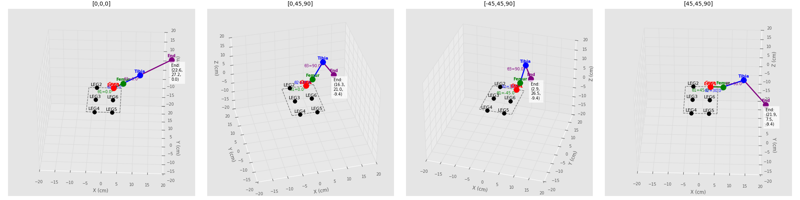

# Hexapod Robot Leg Kinematics

This is a Python implementation of the kinematics for a hexapod robot.

## Installation & Setup

1. Create a virtual environment:

Windows:
```bash
python -m venv .venv
```

2. Activate the virtual environment:

Windows (PowerShell):
```bash
.\.venv\Scripts\activate
```

Windows (Command Prompt):
```bash
.venv\Scripts\activate.bat
```

Linux/Mac:
```bash
source .venv/bin/activate
```

3. Install the dependencies:

```bash
python -m pip install --upgrade pip
pip install -r requirements.txt
```

4. Run the script:

```bash
python leg_test_kinematics.py
```

## Example Visualization

When you run the script, you'll see a 3D visualization like this:



### Understanding the Visualization


1. **Joint Colors**:
   - Red: Coxa joint (base)
   - Green: Femur joint (middle)
   - Blue: Tibia joint (end)
   - Purple: End effector (tip)

2. **Body Outline**: Black dashed lines show the hexapod body frame
3. **Angles**: θ1, θ2, θ3 show the current joint angles
4. **Coordinates**: End effector position is shown in (x, y, z)

## Leg Configuration

The hexapod has 6 legs arranged as follows:

- LEG1: Right front
- LEG2: Left front
- LEG3: Left middle
- LEG4: Left rear
- LEG5: Right rear
- LEG6: Right middle

## Features

The 3D visualization includes:
- Joint positions and connections
- Joint angles
- End effector coordinates
- Body outline
- Leg mounting points

## Troubleshooting

If you encounter installation issues:

1. Make sure you're in the correct directory:
```bash
cd path/to/hexapod-kinematics
```

2. Try removing and recreating the virtual environment:
```bash
python -m venv venv
```

3. If pip install fails, try:
```bash
python -m pip install -r requirements.txt
```

## Contributing

Feel free to open issues or submit pull requests for improvements.

## License

MIT License
